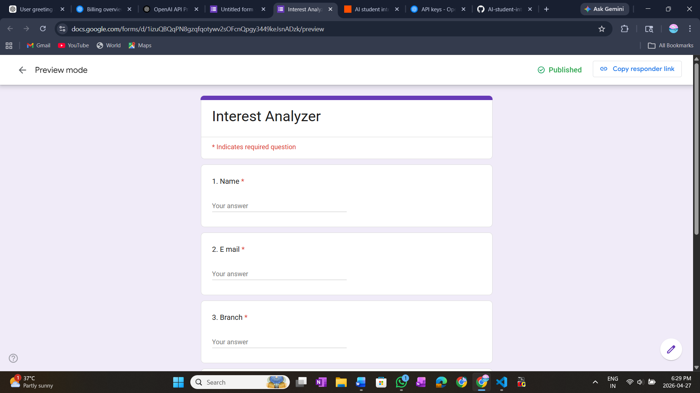
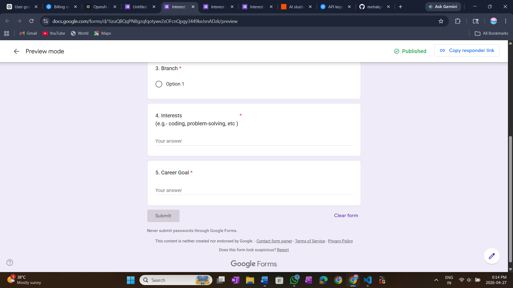

# AI Student Interest Analyzer (Automation Project)

## 📌 Project Overview
This project is an AI-powered automation system that analyzes student interests and sends personalized career suggestions via email.

---

## 🔄 Workflow
Google Form → Zapier → OpenAI → Email

---

## 🧰 Tools Used
- Google Forms (data collection)
- Zapier (automation)
- OpenAI API (AI response generation)
- Gmail (email delivery)

---

## ⚙️ How It Works

1. Student fills Google Form with:
   - Name
   - Email
   - Branch
   - Interests
   - Career Goal

2. Zapier detects new response

3. Data is sent to OpenAI API

4. AI generates personalized suggestion

5. Email is automatically sent to student

---

## 🧠 Prompt Used

You are a career advisor.

Student Name: {{Name}}  
Branch: {{Branch}}  
Interests: {{Interests}}  
Career Goal: {{Career Goal}}  

Write a short personalized message suggesting a suitable career path and encouraging the student.

---

## 🖼️ Screenshots

### Google Form

### Zapier Trigger

### Workflow Diagram

---

## 📹 Loom Video
 
---

## 🎯 Conclusion
This project demonstrates how AI and automation can be combined to build intelligent systems for real-world applications like career guidance.
